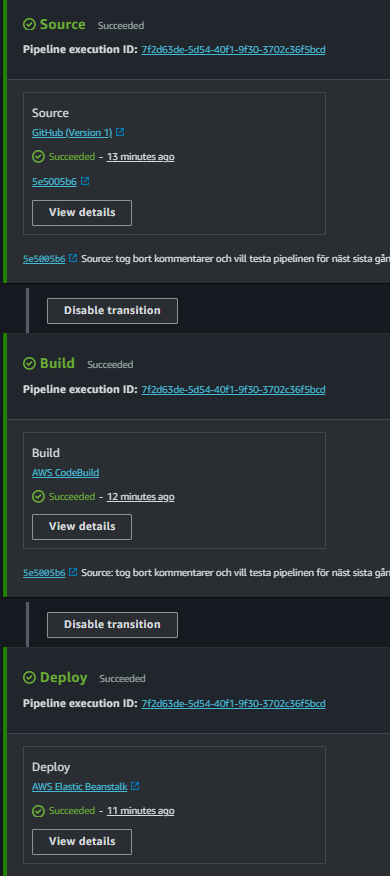
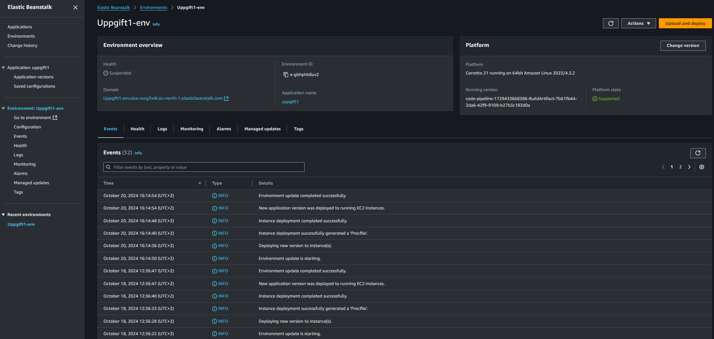
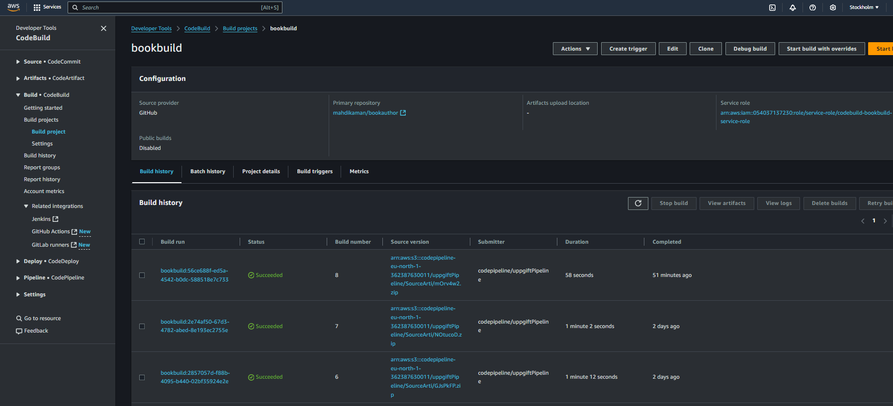
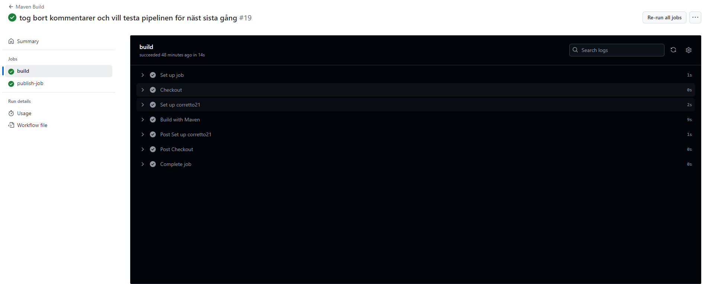

# Book Author Service

Detta projekt är en mikrotjänst byggd med Spring Boot som hanterar böcker och författare. Systemet erbjuder API-endpunkter för att skapa, läsa, uppdatera och radera (CRUD) böcker och författare. Tjänsten är också integrerad med en MySQL-databas och hanterar bok-författar-relationer.

## Funktionalitet

Denna tjänst erbjuder API-funktionalitet för:

- Hämta alla författare och böcker.
- Hämta en enskild författare eller bok baserat på ID.
- Skapa en ny författare eller bok.
- Uppdatera en existerande författare eller bok.
- Radera en författare eller bok.

## Teknologier som används

- **Java 17** - Programmeringsspråk.
- **Spring Boot** - Framework för att bygga REST-API:er.
- **MySQL** - Databas för lagring av böcker och författare.
- **Hibernate** - ORM-verktyg för interaktion med databasen.
- **JUnit och Mockito** - Används för att skriva enhetstester.
- **GitHub Actions** - CI/CD-pipeline för bygg och deploy.

## Databasinställningar

```properties
spring.datasource.url=jdbc:mysql://database-1.c1mig6em6bk5.eu-north-1.rds.amazonaws.com:3306/databas1?createDatabaseIfNotExist=true&useSSL=false&serverTimezone=UTC
spring.datasource.username=root
spring.datasource.password=AgueroAguero123!
spring.datasource.driver-class-name=com.mysql.cj.jdbc.Driver
```
## AWS
Pipelinen startas av en GitHub App som meddelar AWS CodePipeline när en ny push eller pull request har skett i repot. CodePipeline hämtar sedan koden från GitHub-repot, bygger projektet, paketerar det och distribuerar det till en Elastic Beanstalk-miljö på AWS som gör programmet tillgängligt via HTTP.





## Github Actions

Projektet använder GitHub Actions för att automatisera byggprocessen och publicera artifacts. Workflowen inkluderar följande steg:

Bygg med Maven - Kompilerar koden och kör tester.
Publicera artifact - Laddar upp den färdiga .jar-filen som ett GitHub-artifact.

```properties
name: 'Maven Build'

on: push

jobs:
build:
runs-on: ubuntu-latest

steps:
- name: Checkout
uses: actions/checkout@v4
- name: Set up corretto21
uses: actions/setup-java@v4
with:
java-version: '17'
distribution: 'temurin'
cache: maven
- name: Build with Maven
run: mvn -B package --file pom.xml

publish-job:
runs-on: ubuntu-latest
needs: build
steps:
- name: Checkout av kod
uses: actions/checkout@v4
- name: Setup av Java
uses: actions/setup-java@v4
with:
java-version: '17'
distribution: 'temurin'
- run: mvn --batch-mode --update-snapshots verify
- run: mkdir staging && cp target/*.jar staging
- name: Laddar upp artifact
uses: actions/upload-artifact@v4
with:
name: Package
path: staging
```

